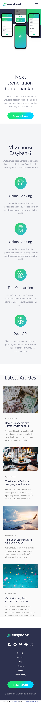

# Frontend Mentor - Easybank landing page solution By [Vinicius ALves da Rocha](https://www.linkedin.com/in/vinicius-rocha-developer/)

This is a solution to the [Easybank landing page challenge on Frontend Mentor](https://www.frontendmentor.io/challenges/easybank-landing-page-WaUhkoDN). Frontend Mentor challenges help you improve your coding skills by building realistic projects. 

## Table of contents

- [Overview](#overview)
  - [The challenge](#the-challenge)
  - [Screenshots](#screenshots)
  - [Links](#links)
- [My process](#my-process)
  - [Built with](#built-with)
  - [What I learned](#what-i-learned)
- [Author](#author)
- [Acknowledgments](#acknowledgments)

## Overview

### The challenge

Users should be able to:

- View the optimal layout for the site depending on their device's screen size
- See hover states for all interactive elements on the page

##screenshots
### Screenshot Mobile

### Screenshot desktop

### Links

- Solution URL GitHUb: [https://github.com/ViniciusAlvesRocha/easy-bank-landing-page-master](https://your-solution-url.com)
- Live Site URL GitHub Pages: [https://viniciusalvesrocha.github.io/easy-bank-landing-page-master/build/](https://your-live-site-url.com)

## My process

### Built with

- Semantic HTML5 markup
- CSS custom properties
- Flexbox
- Mobile-first workflow
- [React](https://reactjs.org/) - JS library

### What I learned

Improve my knowledge in CSS and React JS.

I used this chellenge to improve my skills in fronend.
The reason to I build this project was to show the reviewers what
I dominate Frontend development.

## Author

- Website - [Vinicius Alves da Rocha](https://viniciusalvesrocha.github.io/portfolio/)
- Frontend Mentor - [@yourusername](https://www.frontendmentor.io/profile/yourusername)
- Linkedin - [Vinicius Alves da Rocha](https://www.linkedin.com/in/vinicius-rocha-developer/)
- Instagram - [@rochavini1](https://www.instagram.com/rochavini1/)

